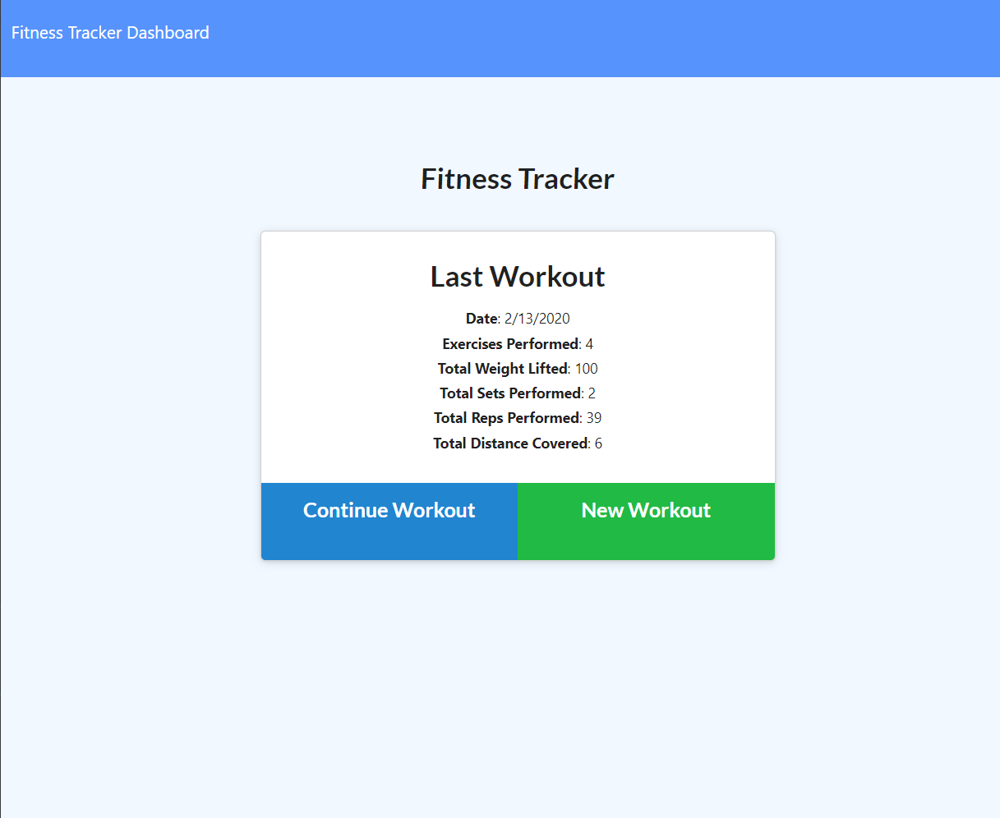
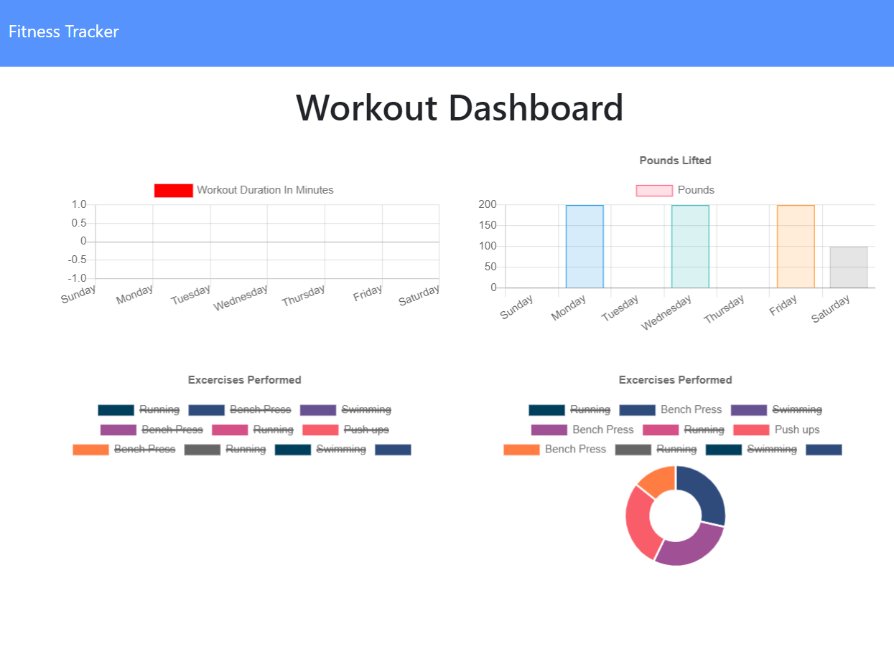

# Description 
This is a Mongo database with a Mongoose schema and handles routes with Express. [Link to Heroku application here!](https://fit-ness.herokuapp.com/)

# Table of Contents
* [Installation](#installation)
* [Usage](#usage)
* [Links](#links)
* [Tools](#tools)
* [Credits](#credits)
* [License](#license)

## Installation 
The user will clone the repository and run `npm install` in the root, client, and server directories. This will be followed by running `npm start` in order to connect to the server. 

## Usage
* As a user, I want to be able to view create and track daily workouts.

A consumer will reach their fitness goals quicker when they track their workout progress.

When the user loads the page, they are given the option to create a new workout, or to continue with their last workout.

The user is be able to:

  * Add exercises to a previous workout plan.

  * Add new exercises to a new workout plan.

Latest Workout Displayed
  Date
  Exercise type (Cardio)
  Total workout duration : minutes
  Exercises performed : (2, 5 times)
  Total weight lifted: 200lbs
  Total sets performed: 1 set
  Total reps performed: 10

## Links

## Tools
* MongoDB
* Mongoose
* MongoDB Atlas 
* Express
* Morgan

## Credits
* Completed by: [Amna Syeda](https://github.com/amnasyeda)

## License

[ISC License](https://www.isc.org/licenses/)
